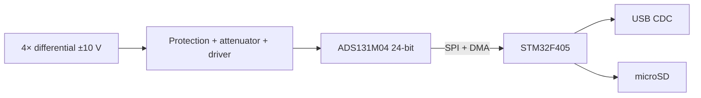

# Public README Template

[← Index](00-index.md) · [Publishing](06-publishing.md)

> A reviewer gives your repo 90 seconds. The README decides whether it becomes 15 minutes. Optimise ruthlessly for that first screen: **what it is, what it proves, and one number.**

---

```markdown
# QUADRA-24 — 4-channel 24-bit precision DAQ

[](link) [](link) [](link) [](link)

**A simultaneously-sampling 4-channel data acquisition board designed to a written noise budget
and verified to 20.4 noise-free bits — 0.4 bits better than the requirement, and 1.3 bits worse
than my prediction. This README explains the gap.**


---

## What this demonstrates

| | |
|---|---|
| **Hardware** | 4-layer mixed-signal design, low-noise power architecture, precision reference, KiCad → JLCPCB turnkey assembly |
| **Firmware** | STM32F405 bare-metal + DMA acquisition at 32 kSPS with zero loss over 24 h, USB CDC streaming, SD logging |
| **Process** | 47 EARS requirements, full traceability, 201 automated tests across unit / emulated / hardware-in-the-loop |
| **Analysis** | Noise budget predicted, measured, and reconciled; ENOB, THD, crosstalk, and tempco characterised |

## Headline results

| Metric | Requirement | Measured | Evidence |
|---|---|---|---|
| Noise-free bits @ 1 kSPS | ≥ 20.0 | **20.4** | [report](docs/07-test-report.md#tc-p14-003) |
| Input-referred noise, 0.1–10 Hz | ≤ 3.0 µV RMS | **2.1 µV** | [plot](docs/media/noise_0p1_10.png) |
| THD @ 1 kHz FS | ≤ −100 dB | **−104 dB** | [plot](docs/media/thd.png) |
| Crosstalk @ 1 kHz | ≤ −100 dB | **−112 dB** | [data](reports/2026-11-03/crosstalk.csv) |
| Sustained USB streaming | 0 lost samples / 3600 s | **0 / 86,400 s** | [soak log](reports/soak/) |


## The interesting part

*Two or three paragraphs on the hardest problem and how you solved it. Not a feature list —
a story with a technical payoff. For this board: the 6 dB gap between the predicted and measured
noise floor, traced to the buck converter's 2.2 MHz fundamental coupling into the reference
through a shared plane region; fixed by moving the reference filter and adding a local ferrite,
measured again, gap closed to 1.2 dB.*

## Architecture



## Repository layout

| Path | Contents |
|---|---|
| `hw/kicad/` | Schematic and PCB sources |
| `hw/fab/` | Generated fabrication package (reproducible via `make fab`) |
| `docs/` | Requirements, architecture, test plan, reports, analysis |
| `src/` | Firmware — `domain/` is hardware-free and host-testable |
| `test/` | `unit/` (host), `integration/` (Renode), `hil/` (real hardware) |
| `tools/` | RTM generation, fab export, measurement analysis scripts |

## Build and run

```bash
git clone … && cd p14-quadra-daq
cmake --preset target-Release && cmake --build --preset target-Release
probe-rs download --chip STM32F405RG build/firmware.elf

# host unit tests
cmake --preset host-test && ctest --preset host-test

# emulated integration tests
renode-test test/integration/renode/*.robot
```

## Reproducing the measurements

Every plot in this repo is generated from committed raw data:

```bash
python tools/analyze/plot_noise.py --in reports/2026-11-03/shorted_1ksps.csv \
                                   --out docs/media/noise_0p1_10.png
```

## Documentation

- [Requirements (SRS)](docs/02-srs.md) · [Traceability matrix](docs/06-rtm.md) · [Test report](docs/07-test-report.md)
- [Noise budget analysis](docs/analysis/noise-budget.md)
- [Bring-up log](docs/09-bringup.md) · [Errata and Rev A→B changes](docs/10-eco-log.md)
- [Architecture decisions](docs/adr/)
- **Article:** *[I designed a 24-bit DAQ, predicted its noise floor, and was wrong by 6 dB](link)*

## What I'd do differently

*Three or four honest bullets. This section makes reviewers trust everything above it.*

- The buck converter should have been on the opposite board edge from the start; the "it's far enough" judgement was not backed by a calculation.
- I specified 0.1 % discrete resistors for the attenuator when a matched network was the right answer — CMRR is set by *matching*, not absolute tolerance.
- The first revision had no way to disconnect the analog front end from the ADC, which made isolating the noise source much slower than it needed to be. Rev B adds 0 Ω links.

## Hardware revision history

| Rev | Date | Changes | Status |
|---|---|---|---|
| A | 2026-09 | Initial | 4 errata, see ECO log |
| B | 2026-11 | Reference filter relocated, 0 Ω isolation links, silkscreen fixes | Current |

## License

Firmware: Apache-2.0 · Hardware: CERN-OHL-S-2.0 · Documentation: CC BY 4.0
```

---

## README rules

1. **One sentence at the top that states what it is and gives one number.** Not "a DAQ project" — "verified to 20.4 noise-free bits."
2. **A photo or plot above the fold.** Hardware projects without a photo look abandoned.
3. **Results table before the how-to.** Reviewers want the claim and the evidence, then the mechanics.
4. **Link to evidence, not to prose.** Every number links to the data or the report.
5. **"What I'd do differently" is mandatory.** It is the section that makes the rest believable.
6. **Build instructions that work from a clean clone.** Test this on a fresh container at least once.
7. **English.** Always.
8. **License your hardware too.** CERN-OHL for hardware, Apache-2.0 or MIT for code, CC BY for docs.

## Badges worth having

Build · Unit tests · Coverage · Static analysis · SITL · **HIL (nightly)** · Docs · Latest release

The HIL badge is the one nobody else has. Make it prominent.

---

[← Index](00-index.md)
