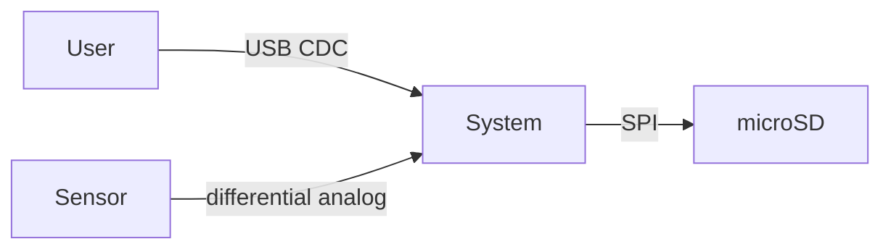

# SRS Template — `docs/02-srs.md`

[← Index](00-index.md) · [Process](02-process.md)

Copy this file into each project. Delete guidance in *italics*. Keep it short — 2–8 pages. A short SRS that is actually maintained beats a long one that rots.

---

```markdown
# Software/System Requirements Specification — <PROJECT NAME>

| | |
|---|---|
| Project ID | Pxx |
| Document version | 1.0 |
| Status | Draft / Approved / Baselined |
| Author | <name> |
| Date | YYYY-MM-DD |
| Baselined at commit | `<sha>` |

## 1. Purpose and scope

*One paragraph: what this system does and what it deliberately does not do.*

**In scope:** …
**Out of scope:** … *(be explicit — this is your defence against scope creep)*

## 2. Stakeholders and needs

| ID | Stakeholder | Need |
|---|---|---|
| N-01 | Portfolio reviewer | Evidence that the author can design a low-noise analog front end |
| N-02 | Future me (reuse) | A characterised acquisition platform reusable by Pxx |
| N-03 | End user (demo) | Acquire and log 4 channels without a PC-side toolchain |

## 3. Definitions and abbreviations

| Term | Meaning |
|---|---|
| ENOB | Effective number of bits |
| … | … |

## 4. System context

*A diagram (Mermaid or an image) showing the system, its external interfaces, and the actors.*



## 4.1 Operational concept

*Modes, transitions, and the 2–4 usage scenarios that become your demonstration/acceptance tests. Skip only for trivial projects.*

```
   POWER-ON ──► INIT ──self-test ok──► IDLE ──start──► RUNNING
                 │                       ▲                │
                 └── fault ──► FAULT ◄───┴──── fault ─────┘
                              (latching, reset to exit)
```

| Mode | Entry | Exit | Requirements that apply only here |
|---|---|---|---|
| INIT | Reset | Self-test pass | Pxx-FUN-002 (boot time) |
| IDLE | | | Pxx-PER-003 (sleep current) |
| RUNNING | | | Pxx-PER-001, Pxx-PER-002 |
| FAULT | Any SAF violation | Reset only | Pxx-SAF-001 |

**Scenarios**

1. *Operator connects USB, launches the host tool, streams 60 s, exports CSV.*
2. *…*

## 5. Assumptions and constraints

| ID | Statement | Type |
|---|---|---|
| A-01 | Ambient temperature is 15–30 °C during characterisation. | Assumption |
| Pxx-CON-001 | The design shall use only components available from LCSC at order time. | Constraint |
| Pxx-CON-002 | Total BOM cost shall not exceed $100 at qty 5. | Constraint |

## 6. Requirements

*Use EARS patterns. One `shall` per requirement. Every requirement has: ID, text, rationale, verification method, priority, status.*

### 6.1 Functional

| ID | Requirement | Rationale | Method | Prio | Status |
|---|---|---|---|---|---|
| Pxx-FUN-001 | The system shall … | … | Test | shall | draft |

### 6.2 Performance

| ID | Requirement | Rationale | Method | Prio | Status |
|---|---|---|---|---|---|

### 6.3 Interface

| ID | Requirement | Rationale | Method | Prio | Status |
|---|---|---|---|---|---|

### 6.4 Electrical / Mechanical / Environmental

| ID | Requirement | Rationale | Method | Prio | Status |
|---|---|---|---|---|---|

### 6.5 Safety / Security / Reliability

| ID | Requirement | Rationale | Method | Prio | Status |
|---|---|---|---|---|---|

### 6.6 Interface Control Document

*Either fill this in per external interface, or split it out to `docs/03-icd.md` once it exceeds a page. Interface requirements (§6.3) point at it. This table is what makes an interface verifiable by Inspection rather than by argument.*

| Property | Value |
|---|---|
| Physical | Connector part number, pinout, mating half, keying |
| Electrical | Levels, V_IL/V_IH, drive strength, termination, max current, ESD rating |
| Timing | Clock rate, setup/hold, frame gap, timeout, retry interval |
| Protocol | Framing, byte order, CRC polynomial + seed + init, escape rules |
| Message table | ID, name, direction, length, rate, fields with units + ranges + scaling |
| Error handling | Behaviour on CRC failure, timeout, unknown ID, buffer overrun |
| Versioning | How a protocol version mismatch is detected and handled |

## 6b. Requirements derived from architecture decisions

*Architecture decisions generate requirements. Record the decision as an ADR in `docs/adr/NNNN-*.md` (Context / Decision / Consequences) and list the children here so the trace is visible in review. This closes the loop between §6 and the design document, and it is the section that most clearly separates an engineered project from a built one.*

| ADR | Decision | Derived requirements |
|---|---|---|
| ADR-0001 | Use an external ΔΣ converter rather than the MCU SAR ADC | Pxx-ELE-010, Pxx-ELE-011, Pxx-INT-005 |
| ADR-0002 | … | … |

## 7. Verification summary

| Method | Count |
|---|---|
| Inspection | |
| Analysis | |
| Demonstration | |
| Test | |

*Full traceability is in the generated `docs/06-rtm.md`.*

## 8. Open issues

| ID | Issue | Owner | Target |
|---|---|---|---|
| OI-01 | Reference tempco requirement may need relaxing pending part availability | me | before G2 |

## 9. Change log

| Version | Date | Change | Commit |
|---|---|---|---|
| 1.0 | | Initial baseline | |
```

---

## Machine-readable form

The tables above are the *rendered* view. The source of truth is YAML, so the RTM can be generated:

```yaml
# docs/requirements/performance.yaml
- id: P14-PER-001
  text: >
    The DAQ shall achieve at least 20.0 noise-free bits at 1 kSPS
    with inputs shorted, at 25 °C ± 5 °C.
  type: performance
  rationale: >
    N-01 requires demonstrable precision-analog capability. 20 noise-free bits
    is achievable with the selected converter per its datasheet (21.7 bits at
    OSR 1024) with ~1.7 bits of margin allocated to the front end and supplies.
  parent: N-01
  priority: shall
  verification: test
  test_case: [TC-P14-003]
  status: draft
  risk: high
  notes: >
    Noise-free bits = log2(FSR / (6.6 * sigma_measured)).
    Distinguish from ENOB (uses RMS, not peak-to-peak).
```

### CI gates on the YAML (implement these in `scripts/gen_rtm.py`)

The build **fails** if any of these is violated. This is a ~150-line script and it is the highest-credibility-per-line-of-code artifact in the whole program.

1. Every requirement with `priority: shall` and `status: approved` has at least one `test_case`.
2. Every `test_case` ID referenced exists in the test suite (matched against `@verifies` tags in test sources).
3. Every `@verifies Pxx-…` tag in a test references a requirement ID that exists.
4. No duplicate IDs; no ID reused after being marked `deleted`.
5. Every requirement has a `parent` that resolves to a need (`N-nn`) or another requirement ID.
6. Every requirement has a non-empty `rationale` and a `verification` method.
7. No requirement text contains a banned word (see below) — a crude regex, but it catches drift.
8. The §7 verification counts in the SRS match the generated totals.

### EARS quick reference

| Pattern | Template |
|---|---|
| Ubiquitous | The `<system>` shall `<response>`. |
| Event-driven | When `<trigger>`, the `<system>` shall `<response>`. |
| State-driven | While `<state>`, the `<system>` shall `<response>`. |
| Unwanted | If `<condition>`, then the `<system>` shall `<response>`. |
| Optional | Where `<feature>`, the `<system>` shall `<response>`. |
| Complex | While `<state>`, when `<trigger>`, the `<system>` shall `<response>`. |

### Banned words

`fast`, `slow`, `robust`, `efficient`, `user-friendly`, `flexible`, `optimal`, `reasonable`, `appropriate`, `as needed`, `if possible`, `etc.`, `and/or`, `support` (as a verb without an object), `handle`, `process` (without saying how the result is observable).

If you cannot replace one of these with a number and a unit, you have not finished thinking about the requirement.

---

[← Index](00-index.md)
